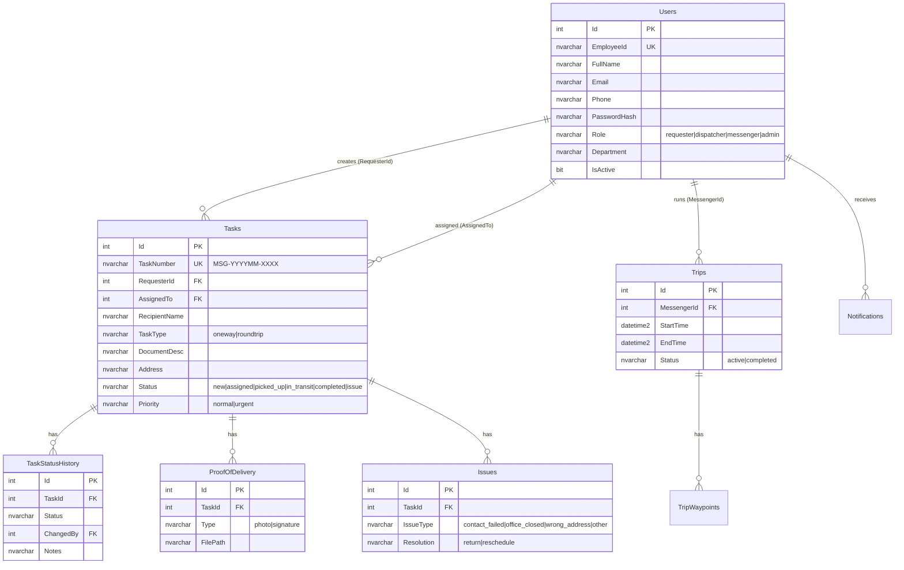

# 📋 Developer Handoff — ระบบบริหารจัดการแมสเซ็นเจอร์และติดตามเอกสาร

> **วันที่ส่งมอบ:** 7 มีนาคม 2026  
> **Repo:** https://github.com/iEel/messenger.git  
> **Branch:** `master`

---

## 1. ภาพรวมโปรเจ็กต์

Web Application สำหรับจัดการการส่ง/รับเอกสารภายในองค์กร มี **4 กลุ่มผู้ใช้:**

| Role | คำอธิบาย | หน้าหลัก |
|------|----------|----------|
| **Requester** | พนักงานทั่วไป สร้างใบงานส่งเอกสาร | `/tasks`, `/tasks/new` |
| **Dispatcher** | หัวหน้าแมส จ่ายงาน+ติดตาม | `/dispatcher`, `/dispatcher/analytics` |
| **Messenger** | แมสเซ็นเจอร์ รับงาน+วิ่งส่ง | `/messenger`, `/messenger/deliver/[id]` |
| **Admin** | ดูแลระบบ จัดการ User | `/admin/users` |

---

## 2. Tech Stack

| ส่วนประกอบ | เทคโนโลยี | เวอร์ชัน |
|-----------|-----------|---------|
| Framework | Next.js (App Router) | 16.1.6 |
| Language | TypeScript | 5.x |
| Styling | Tailwind CSS | v4 |
| Database | Microsoft SQL Server | (Named Instance: `alpha`) |
| Auth | NextAuth.js (Credentials) + bcryptjs | 5.0.0-beta.30 |
| Icons | Lucide React | 0.577.0 |
| DB Driver | mssql (tedious) | 12.2.0 |

---

## 3. การติดตั้ง

### 3.1 Prerequisites
- **Node.js** ≥ 18
- **MS SQL Server** (ต้องมี Named Instance `alpha` หรือแก้ใน `.env.local`)
- **Git**

### 3.2 ขั้นตอน

```bash
# 1. Clone repo
git clone https://github.com/iEel/messenger.git
cd messenger

# 2. ติดตั้ง dependencies
npm install --legacy-peer-deps

# 3. ตั้งค่า Environment
#    คัดลอก .env.local จาก developer เดิม หรือสร้างใหม่ตามโครงสร้างด้านล่าง

# 4. สร้าง Database
#    รัน database/schema.sql ใน SQL Server Management Studio

# 5. สร้าง Admin user ตั้งต้น
node database/setup.js

# 6. รัน Dev server
npm run dev
#    → http://localhost:3000
```

### 3.3 Environment Variables (`.env.local`)

```env
# Database
DB_SERVER=192.168.110.106
DB_INSTANCE=alpha
DB_NAME=MessengerDB
DB_USER=sa
DB_PASSWORD=<password>
DB_PORT=1433

# App
PORT=3000

# NextAuth
NEXTAUTH_URL=http://localhost:3000
NEXTAUTH_SECRET=<random-secret>

# Google Maps (ยังไม่ได้ใช้)
NEXT_PUBLIC_GOOGLE_MAPS_API_KEY=

# Outlook 365 (ยังไม่ได้ implement)
OUTLOOK_CLIENT_ID=
OUTLOOK_CLIENT_SECRET=
OUTLOOK_TENANT_ID=
OUTLOOK_SENDER_EMAIL=

# Upload
UPLOAD_DIR=./uploads
```

---

## 4. โครงสร้างโปรเจ็กต์

```
d:\Antigravity\messenger\
├── database/
│   ├── schema.sql       ← SQL สร้างตาราง (8 ตาราง)
│   ├── setup.js         ← สร้าง Admin user ตั้งต้น
│   └── update-admin.js  ← Script อัปเดตรหัสผ่าน Admin
│
├── src/
│   ├── app/
│   │   ├── (auth)/login/              ← หน้า Login
│   │   ├── (main)/                    ← Layout มี Sidebar
│   │   │   ├── admin/users/           ← CRUD ผู้ใช้
│   │   │   ├── dashboard/             ← Dashboard
│   │   │   ├── tasks/                 ← รายการ/สร้าง/รายละเอียดใบงาน
│   │   │   ├── dispatcher/            ← จ่ายงาน + รายงาน
│   │   │   └── messenger/             ← Hub แมส + ส่งเอกสาร + แจ้งปัญหา
│   │   ├── api/
│   │   │   ├── auth/[...nextauth]/    ← NextAuth handler
│   │   │   ├── analytics/             ← API รายงาน
│   │   │   ├── messengers/            ← ดึงรายชื่อแมส
│   │   │   ├── tasks/                 ← CRUD ใบงาน
│   │   │   ├── trips/                 ← เริ่ม/จบรอบวิ่ง
│   │   │   └── users/                 ← CRUD ผู้ใช้
│   │   ├── globals.css
│   │   ├── layout.tsx                 ← Root layout
│   │   └── page.tsx                   ← Redirect → /login
│   │
│   ├── components/
│   │   ├── layout/Sidebar.tsx         ← Sidebar (role-based nav)
│   │   ├── ui/AddressAutocomplete.tsx ← ค้นหาที่อยู่ไทย
│   │   ├── ui/SignaturePad.tsx        ← Canvas เซ็นชื่อ
│   │   ├── Providers.tsx              ← SessionProvider wrapper
│   │   └── ThemeProvider.tsx          ← Dark/Light mode
│   │
│   └── lib/
│       ├── auth.ts                    ← NextAuth config
│       ├── db.ts                      ← SQL Server connection
│       ├── types.ts                   ← TypeScript types + STATUS_CONFIG
│       └── thailand-address.ts        ← ที่อยู่ไทย 7,436 ตำบล
│
├── .env.local
├── package.json
├── next.config.ts
└── tsconfig.json
```

---

## 5. Database Schema (8 ตาราง)



> **หมายเหตุ:** ตาราง `TripWaypoints`, `Notifications`, `SystemSettings` มีอยู่ใน schema แต่ยังไม่ได้ใช้งานจริงในโค้ด

---

## 6. API Reference

### 6.1 Authentication
| Method | Path | คำอธิบาย |
|--------|------|----------|
| POST | `/api/auth/[...nextauth]` | NextAuth.js handler (login/logout/session) |

### 6.2 Users
| Method | Path | คำอธิบาย |
|--------|------|----------|
| GET | `/api/users` | รายชื่อ users ทั้งหมด (filter: `?role=`, `?search=`) |
| POST | `/api/users` | สร้าง user ใหม่ |
| GET | `/api/users/[id]` | ดึงข้อมูล user |
| PATCH | `/api/users/[id]` | แก้ไข user |
| GET | `/api/messengers` | ดึงรายชื่อแมสเซ็นเจอร์ (active only) |

### 6.3 Tasks
| Method | Path | คำอธิบาย |
|--------|------|----------|
| GET | `/api/tasks` | รายการใบงาน (`?status=`, `?search=`, `?page=`, `?limit=`) |
| POST | `/api/tasks` | สร้างใบงานใหม่ (auto-generate TaskNumber) |
| GET | `/api/tasks/[id]` | รายละเอียดใบงาน + status history |
| PATCH | `/api/tasks/[id]` | อัปเดตสถานะ / assign แมส |

### 6.4 Trips
| Method | Path | คำอธิบาย |
|--------|------|----------|
| GET | `/api/trips` | รอบวิ่งของแมส (`?status=active`) |
| POST | `/api/trips` | เริ่มรอบวิ่งใหม่ |
| PATCH | `/api/trips/[id]` | จบรอบวิ่ง |

### 6.5 Analytics
| Method | Path | คำอธิบาย |
|--------|------|----------|
| GET | `/api/analytics` | สถิติวันนี้, 7 วันย้อนหลัง, Top 5 แมส |

---

## 7. Task Status Flow

```
new → assigned → picked_up → in_transit → completed
                                    ↓
                                  issue → return / reschedule
```

| Status | คำอธิบาย | ใครเปลี่ยน |
|--------|----------|-----------|
| `new` | ใบงานใหม่ รอจ่ายงาน | สร้างอัตโนมัติ |
| `assigned` | จ่ายงานแล้ว | Dispatcher |
| `picked_up` | แมสรับเอกสารแล้ว | Messenger |
| `in_transit` | กำลังเดินทางส่ง | Messenger |
| `completed` | ส่งสำเร็จ (ต้อง POD) | Messenger |
| `issue` | มีปัญหา | Messenger |

---

## 8. สิ่งที่ทำเสร็จแล้ว ✅

### Phase 1 — Login + User Management
- หน้า Login (glassmorphism, dark/light mode)
- NextAuth.js Credentials + bcrypt
- CRUD ผู้ใช้ (ตาราง, สร้าง, แก้ไข, กรอง role)
- Sidebar role-based navigation

### Phase 2 — Requester
- ฟอร์มสร้างใบงาน + auto TaskNumber (MSG-YYYYMM-XXXX)
- **Address Autocomplete** (ที่อยู่ไทย 7,436 ตำบล ครบ 77 จังหวัด)
- รายการใบงาน + ค้นหา/กรอง/pagination
- หน้ารายละเอียดใบงาน + status timeline
- Action Center สำหรับงานที่มีปัญหา (คืน/เลื่อน)

### Phase 3 — Dispatcher
- กระดานจ่ายงาน + assign modal
- แจ้งเตือนด่วน (กระพริบแดง `.issue-flash`)
- **รายงานจาก DB จริง** (6 stat cards, donut chart, bar chart 7 วัน, leaderboard)

### Phase 4 — Messenger
- จัดการรอบวิ่ง (Start/End Trip) + live timer
- Progressive status buttons (assigned → picked_up → in_transit)
- ปุ่มนำทาง Google Maps (two-wheeler)
- Click-to-call ผู้รับ
- แจ้งปัญหาหน้างาน (4 ประเภท)
- **Proof of Delivery** — ถ่ายรูป (max 3) + เซ็นชื่อ Canvas + ชื่อผู้รับจริง

---

## 9. สิ่งที่ยังไม่ได้ทำ ❌ (เรียงตามความสำคัญ)

### 🔴 สำคัญสูง

| # | ฟีเจอร์ | รายละเอียด | ตารางที่เกี่ยวข้อง |
|---|---------|-----------|-------------------|
| 1 | **File Upload จริง (POD)** | ถ่ายรูป+เซ็นชื่อ ตอนนี้ยังไม่ได้ save ไฟล์จริงลง server มีแค่ UI (ส่ง base64 ไป API) ต้อง implement upload API + save ลง `ProofOfDelivery` table | `ProofOfDelivery` |
| 2 | **งานไป-กลับ (Roundtrip) Flow สมบูรณ์** | แมสต้องรับเอกสารกลับ → ส่งคืนออฟฟิศ status: `return_picked_up` → `returning` → `returned` | `Tasks`, `TaskStatusHistory` |
| 3 | **อีเมลแจ้งเตือน** | ใช้ Outlook 365 OAuth / Nodemailer ส่งเมลเมื่อมีงานใหม่, Issue alert, สรุปรายวัน | `Notifications` |

### 🟡 สำคัญปานกลาง

| # | ฟีเจอร์ | รายละเอียด |
|---|---------|-----------|
| 4 | **Zone Clustering** | จัดกลุ่มงานตามเขต/พื้นที่ ช่วยจ่ายงานอย่างมีประสิทธิภาพ |
| 5 | **Real-time Update** | ใช้ polling ทุก 30 วินาที หรือ WebSocket ให้แดชบอร์ด Dispatcher update อัตโนมัติ |
| 6 | **Export CSV/Excel** | ส่งออกรายงาน (ใช้ `xlsx` หรือ `csv-stringify`) |

### 🟢 ภายหลัง

| # | ฟีเจอร์ | รายละเอียด |
|---|---------|-----------|
| 7 | **คำนวณระยะทาง** | Google Maps Routes API (mode: TWO_WHEELER) ต้องสมัคร API Key |
| 8 | **PWA + Offline** | `manifest.json` + Service Worker + ใช้ `next-pwa` package |
| 9 | **Reusable UI Components** | แยก Button, Modal, Table, Badge เป็น component กลาง ใน `components/ui/` |
| 10 | **Map Picker** | Maps JavaScript API ปักหมุดเลือกพิกัดบนแผนที่ |

---

## 10. Known Issues & Technical Debt

| # | ปัญหา | ผลกระทบ | แนวทางแก้ |
|---|-------|---------|----------|
| 1 | `nodemailer` peer dependency conflict | ต้องใช้ `--legacy-peer-deps` ตอน install | อัปเกรด `next-auth` เป็น stable version |
| 2 | NEXTAUTH_SECRET ใช้ค่า default | ไม่ปลอดภัยสำหรับ production | เปลี่ยนเป็น random 32+ chars |
| 3 | DB password ใน `.env.local` เป็น plaintext | ไม่ควรอยู่ใน repo | ใช้ Secret Manager / Vault |
| 4 | POD ส่ง base64 แต่ไม่ได้ save ลง disk/DB | ข้อมูลจะหาย | Implement file storage + `ProofOfDelivery` table |
| 5 | ไม่มี rate limiting | API อาจถูก abuse | ใช้ `next-rate-limit` middleware |
| 6 | ไม่มี input validation (Zod/Yup) | SQL Injection risk น้อย (parameterized) แต่ data อาจไม่ถูกต้อง | เพิ่ม Zod validation |

---

## 11. Default Credentials

| Username | Password | Role |
|----------|----------|------|
| `admin` | `admin1234` | admin |

> ⚠️ **เปลี่ยนรหัสผ่านก่อน deploy production**

---

## 12. Deployment Notes

```bash
# Build production
npm run build

# Start production
npm run start
# หรือใช้ PM2:
pm2 start npm --name "messenger" -- start
```

**Checklist ก่อน Production:**
- [ ] เปลี่ยน `NEXTAUTH_SECRET` เป็นค่าสุ่ม
- [ ] เปลี่ยนรหัสผ่าน DB
- [ ] เปลี่ยน admin password
- [ ] ตั้ง `NEXTAUTH_URL` เป็น domain จริง
- [ ] เปิด HTTPS
- [ ] ตั้ง environment variables ผ่าน server / secret manager (ไม่เก็บใน repo)
