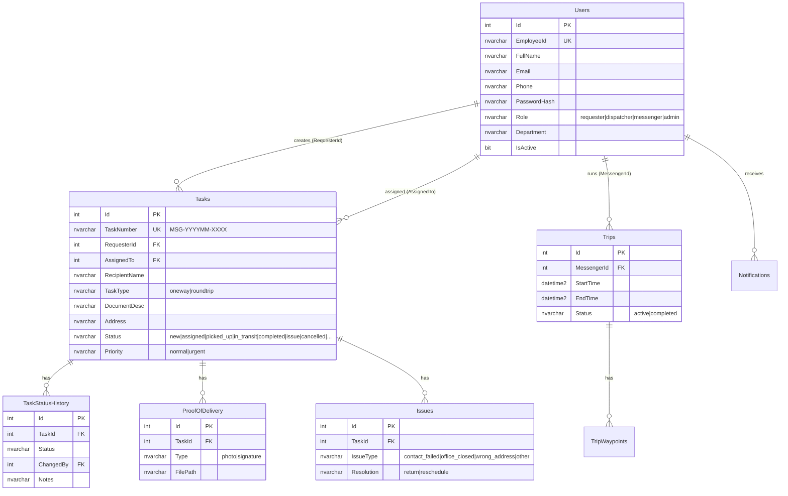

# 📋 Developer Handoff — ระบบบริหารจัดการแมสเซ็นเจอร์และติดตามเอกสาร

> **วันที่ส่งมอบ:** 7 มีนาคม 2026  
> **Repo:** https://github.com/iEel/messenger.git  
> **Branch:** `master`

---

## 1. ภาพรวมโปรเจ็กต์

Web Application สำหรับจัดการการส่ง/รับเอกสารภายในองค์กร มี **4 กลุ่มผู้ใช้:**

| Role | คำอธิบาย | หน้าหลัก |
|------|----------|----------|
| **Requester** | พนักงานทั่วไป สร้างใบงานส่งเอกสาร | `/tasks`, `/tasks/new` |
| **Dispatcher** | หัวหน้าแมส จ่ายงาน+ติดตาม | `/dispatcher`, `/dispatcher/analytics` |
| **Messenger** | แมสเซ็นเจอร์ รับงาน+วิ่งส่ง | `/messenger`, `/messenger/deliver/[id]` |
| **Admin** | ดูแลระบบ จัดการ User + ตั้งค่า | `/admin/users`, `/admin/settings`, `/admin/rate-limit` |

---

## 2. Tech Stack

| ส่วนประกอบ | เทคโนโลยี | เวอร์ชัน |
|-----------|-----------|---------|
| Framework | Next.js (App Router) | 16.1.6 |
| Language | TypeScript | 5.x |
| Styling | Tailwind CSS | v4 |
| Database | Microsoft SQL Server | (Named Instance: `alpha`) |
| Auth | NextAuth.js (Credentials) + bcryptjs | 5.0.0-beta.30 |
| Icons | Lucide React | 0.577.0 |
| DB Driver | mssql (tedious) | 12.2.0 |

---

## 3. การติดตั้ง

### 3.1 Prerequisites
- **Node.js** ≥ 18
- **MS SQL Server** (ต้องมี Named Instance `alpha` หรือแก้ใน `.env.local`)
- **Git**

### 3.2 ขั้นตอน

```bash
# 1. Clone repo
git clone https://github.com/iEel/messenger.git
cd messenger

# 2. ติดตั้ง dependencies
npm install --legacy-peer-deps

# 3. ตั้งค่า Environment
#    คัดลอก .env.local จาก developer เดิม หรือสร้างใหม่ตามโครงสร้างด้านล่าง

# 4. สร้าง Database
#    รัน database/schema.sql ใน SQL Server Management Studio

# 5. สร้าง Admin user ตั้งต้น
node database/setup.js

# 6. รัน Dev server
npm run dev
#    → http://localhost:3000
```

### 3.3 Environment Variables (`.env.local`)

```env
# Database
DB_SERVER=192.168.110.106
DB_INSTANCE=alpha
DB_NAME=MessengerDB
DB_USER=sa
DB_PASSWORD=<password>
DB_PORT=1433

# App
PORT=3000

# NextAuth
NEXTAUTH_URL=http://localhost:3000
NEXTAUTH_SECRET=<random-secret>

# Google Maps (ใช้คำนวณระยะทาง + Autocomplete)
NEXT_PUBLIC_GOOGLE_MAPS_API_KEY=<your-api-key>

# Outlook 365 (ยังไม่ได้ implement)
OUTLOOK_CLIENT_ID=
OUTLOOK_CLIENT_SECRET=
OUTLOOK_TENANT_ID=
OUTLOOK_SENDER_EMAIL=

# Upload
UPLOAD_DIR=./uploads
```

---

## 4. โครงสร้างโปรเจ็กต์

```
d:\Antigravity\messenger\
├── database/
│   ├── schema.sql       ← SQL สร้างตาราง (8 ตาราง)
│   ├── setup.js         ← สร้าง Admin user ตั้งต้น
│   └── update-admin.js  ← Script อัปเดตรหัสผ่าน Admin
│
├── src/
│   ├── app/
│   │   ├── (auth)/login/              ← หน้า Login
│   │   ├── (main)/                    ← Layout มี Sidebar
│   │   │   ├── admin/users/           ← CRUD ผู้ใช้
│   │   │   ├── admin/settings/        ← ★ ตั้งค่าระบบ (พิกัดออฟฟิศ, prefix)
│   │   │   ├── dashboard/             ← Dashboard
│   │   │   ├── tasks/                 ← รายการ/สร้าง/รายละเอียดใบงาน
│   │   │   ├── tasks/[id]/edit/       ← ★ แก้ไขใบงาน
│   │   │   ├── dispatcher/            ← จ่ายงาน + รายงาน + ระยะทาง
│   │   │   └── messenger/             ← Hub แมส + ส่งเอกสาร + แจ้งปัญหา + ★ Drag&Drop + Smart Routing
│   │   ├── api/
│   │   │   ├── auth/[...nextauth]/    ← NextAuth handler
│   │   │   ├── analytics/             ← API รายงาน
│   │   │   ├── distance/              ← ★ API คำนวณระยะทาง (Routes API v2)
│   │   │   ├── maps-resolve/          ← ★ Resolve short URL (goo.gl)
│   │   │   ├── messengers/            ← ดึงรายชื่อแมส
│   │   │   ├── routes/optimize/       ← ★ Route Optimization (จัดเส้นทาง + Priority lock)
│   │   │   ├── settings/              ← ★ API ตั้งค่าระบบ (GET/PATCH)
│   │   │   ├── tasks/                 ← CRUD ใบงาน (GET/POST/PATCH/PUT) + POD data
│   │   │   ├── trips/                 ← เริ่ม/จบรอบวิ่ง + ★ Loop Closing
│   │   │   ├── upload/                ← ★ อัปโหลดไฟล์ POD (photo/signature)
│   │   │   ├── uploads/[...path]/     ← ★ Serve ไฟล์อัปโหลด (auth protected)
│   │   │   └── users/                 ← CRUD ผู้ใช้
│   │   ├── globals.css
│   │   ├── layout.tsx                 ← Root layout + PWA manifest + SW registration
│   │   └── page.tsx                   ← Redirect → /login
│   │
│   ├── components/
│   │   ├── layout/Sidebar.tsx         ← Sidebar (role-based nav)
│   │   ├── ui/AddressAutocomplete.tsx ← ค้นหาที่อยู่ไทย
│   │   ├── ui/Badge.tsx              ← ★ Reusable Badge (6 variants + pulse)
│   │   ├── ui/Button.tsx             ← ★ Reusable Button (4 variants + loading + icon)
│   │   ├── ui/MapPicker.tsx          ← ★ Google Maps ปักหมุด + Places Autocomplete ค้นหาสถานที่
│   │   ├── ui/Modal.tsx              ← ★ Reusable Modal (Esc/overlay close + sizes)
│   │   ├── ui/PhoneInput.tsx          ← ★ เบอร์โทรไทย (mask + validation)
│   │   ├── ui/SignaturePad.tsx        ← Canvas เซ็นชื่อ
│   │   ├── Providers.tsx              ← SessionProvider wrapper
│   │   └── ThemeProvider.tsx          ← Dark/Light mode
│   │
│   └── lib/
│       ├── auth.ts                    ← NextAuth config
│       ├── date-utils.ts              ← ★ Format วันเวลา (แก้ timezone + ปี ค.ศ.)
│       ├── db.ts                      ← SQL Server connection
│       ├── distance.ts                ← ★ Routes API v2 (TWO_WHEELER) + Haversine + Route Optimization
│       ├── route-cache.ts             ← ★ In-memory cache (ลด API calls → ประหยัดค่าใช้จ่าย)
│       ├── email.ts                   ← ★ Email templates (6 templates incl. returned + POD link)
│       ├── types.ts                   ← TypeScript types + STATUS_CONFIG
│       └── thailand-address.ts        ← ที่อยู่ไทย 7,436 ตำบล
│
├── public/
│   ├── favicon.png                ← ★ App icon (ใช้ทั้ง tab + sidebar + login)
│   ├── manifest.json              ← ★ PWA manifest
│   ├── sw.js                      ← ★ Service Worker (offline + background sync)
│   └── icons/                     ← ★ PWA icons (192 + 512)
├── .env.local
├── package.json
├── next.config.ts
└── tsconfig.json
```

---

## 5. Database Schema (8 ตาราง)



> **หมายเหตุ:** ตาราง `TripWaypoints`, `Notifications` มีอยู่ใน schema แต่ยังไม่ได้ใช้งานจริงในโค้ด  
> ตาราง `SystemSettings` ใช้งานแล้ว — เก็บ office_lat, office_lng, task_number_prefix ฯลฯ

---

## 6. API Reference

### 6.1 Authentication
| Method | Path | คำอธิบาย |
|--------|------|----------|
| POST | `/api/auth/[...nextauth]` | NextAuth.js handler (login/logout/session) |

### 6.2 Users
| Method | Path | คำอธิบาย |
|--------|------|----------|
| GET | `/api/users` | รายชื่อ users ทั้งหมด (filter: `?role=`, `?search=`) |
| POST | `/api/users` | สร้าง user ใหม่ |
| GET | `/api/users/[id]` | ดึงข้อมูล user |
| PATCH | `/api/users/[id]` | แก้ไข user |
| GET | `/api/messengers` | ดึงรายชื่อแมสเซ็นเจอร์ (active only) |

### 6.3 Tasks
| Method | Path | คำอธิบาย |
|--------|------|----------|
| GET | `/api/tasks` | รายการใบงาน (`?status=`, `?search=`, `?page=`, `?limit=`) |
| POST | `/api/tasks` | สร้างใบงานใหม่ (auto-generate TaskNumber) |
| GET | `/api/tasks/[id]` | รายละเอียดใบงาน + status history |
| PATCH | `/api/tasks/[id]` | อัปเดตสถานะ / assign / cancel |
| PUT | `/api/tasks/[id]` | ★ แก้ไขข้อมูลใบงาน (เฉพาะ status=new, owner/admin) |

### 6.4 Distance & Maps ★ (อัปเกรด Routes API v2)
| Method | Path | คำอธิบาย |
|--------|------|----------|
| GET | `/api/distance` | ★ คำนวณระยะทาง Routes API v2 TWO_WHEELER + cache (`?taskId=` หรือ `?fromLat=&fromLng=&toLat=&toLng=`) |
| GET | `/api/maps-resolve` | ★ Resolve short URL → ดึง lat/lng (`?url=https://maps.app.goo.gl/xxx`) |

### 6.5 Route Optimization ★ (ใหม่)
| Method | Path | คำอธิบาย |
|--------|------|----------|
| POST | `/api/routes/optimize` | ★ จัดเส้นทาง (body: `{taskIds}`, ล็อค urgent เป็นลำดับ 1, `optimizeWaypointOrder`) |

### 6.6 Settings
| Method | Path | คำอธิบาย |
|--------|------|----------|
| GET | `/api/settings` | ★ ดึงค่าตั้งค่าทั้งหมด |
| PATCH | `/api/settings` | ★ อัปเดตค่าตั้งค่า (admin only, MERGE upsert) |

### 6.7 Trips
| Method | Path | คำอธิบาย |
|--------|------|----------|
| GET | `/api/trips` | รอบวิ่งของแมส (`?status=active`) |
| POST | `/api/trips` | เริ่มรอบวิ่งใหม่ |
| PATCH | `/api/trips/[id]` | ★ จบรอบวิ่ง + Loop Closing (คำนวณระยะทาง office→tasks→office) |

### 6.8 Analytics
| Method | Path | คำอธิบาย |
|--------|------|----------|
| GET | `/api/analytics` | สถิติวันนี้, 7 วันย้อนหลัง, Top 5 แมส |

### 6.9 Upload & Files
| Method | Path | คำอธิบาย |
|--------|------|----------|
| POST | `/api/upload` | ★ อัปโหลดไฟล์ POD (FormData: file, taskId, type=photo/signature) |
| GET | `/api/uploads/[...path]` | ★ Serve ไฟล์อัปโหลด (auth protected, path traversal prevention) |

---

## 7. Task Status Flow

```
new → assigned → picked_up → in_transit → completed
 ↓                                  ↓
cancelled                         issue → return / reschedule
```

| Status | คำอธิบาย | ใครเปลี่ยน |
|--------|----------|-----------|
| `new` | ใบงานใหม่ รอจ่ายงาน (แก้ไข/ยกเลิกได้) | สร้างอัตโนมัติ |
| `assigned` | จ่ายงานแล้ว | Dispatcher |
| `picked_up` | แมสรับเอกสารแล้ว | Messenger |
| `in_transit` | กำลังเดินทางส่ง | Messenger |
| `completed` | ส่งสำเร็จ (ต้อง POD) | Messenger |
| `issue` | มีปัญหา | Messenger |
| `cancelled` | ★ ยกเลิกใบงาน | Requester/Admin |

---

## 8. สิ่งที่ทำเสร็จแล้ว ✅

### Phase 1 — Login + User Management
- หน้า Login (glassmorphism, dark/light mode)
- NextAuth.js Credentials + bcrypt
- CRUD ผู้ใช้ (ตาราง, สร้าง, แก้ไข, กรอง role)
- Sidebar role-based navigation

### Phase 2 — Requester
- ฟอร์มสร้างใบงาน + auto TaskNumber (MSG-YYYYMM-XXXX)
- **Address Autocomplete** (ที่อยู่ไทย 7,436 ตำบล ครบ 77 จังหวัด)
- ★ **Google Maps short URL support** — วาง `maps.app.goo.gl/xxx` ดึงพิกัดอัตโนมัติ (API resolve)
- ★ **Phone Input Validation** — auto-format `0XX-XXX-XXXX`, block ตัวอักษร, real-time validation (เขียว/เหลือง/แดง), ปุ่มโทรเช็ค
- รายการใบงาน + ค้นหา/กรอง/pagination
- หน้ารายละเอียดใบงาน + status timeline
- ★ **แก้ไขใบงาน** — หน้า edit (เฉพาะ status=new, owner/admin)
- ★ **ยกเลิกใบงาน** — confirm dialog → status=cancelled + บันทึกประวัติ
- Action Center สำหรับงานที่มีปัญหา (คืน/เลื่อน)

### Phase 3 — Dispatcher
- กระดานจ่ายงาน + assign modal
- แจ้งเตือนด่วน (กระพริบแดง `.issue-flash`)
- ★ **ปุ่มดูแผนที่** 📍 บนการ์ด — เปิด Google Maps (two_wheeler)
- ★ **แสดงระยะทาง** (km) จากออฟฟิศบนการ์ดใบงาน (Haversine)
- ★ **Zone toggle จำค่า** — localStorage persist เมื่อสลับหน้า
- **รายงานจาก DB จริง** (6 stat cards, donut chart, bar chart 7 วัน, leaderboard)

### Phase 4 — Messenger
- จัดการรอบวิ่ง (Start/End Trip) + live timer
- Progressive status buttons (assigned → picked_up → in_transit)
- ปุ่มนำทาง Google Maps (**two_wheeler** — มอเตอร์ไซค์)
- Click-to-call ผู้รับ
- แจ้งปัญหาหน้างาน (4 ประเภท)
- **Proof of Delivery** — ถ่ายรูป (max 3) + เซ็นชื่อ Canvas + ชื่อผู้รับจริง

### Phase 5 — ระบบสนับสนุน
- ★ **คำนวณระยะทาง** — ~~Google Maps Directions API~~ → ★ **Routes API v2 (TWO_WHEELER)** + Haversine fallback
  - API endpoint `/api/distance` (office→task หรือ custom coords)
  - แสดงระยะทาง+เวลาเดินทาง auto ในหน้ารายละเอียดใบงาน
  - ระบุแหล่งข้อมูล (📡 Google Maps / 📐 ประมาณ)
- ★ **หน้าตั้งค่าระบบ** (`/admin/settings`) — admin only
  - จัดกลุ่ม: พิกัดออฟฟิศ (lat/lng/ชื่อ), คำนำหน้าเลขใบงาน
  - ปุ่มดูตำแหน่งบน Google Maps
  - ตารางแสดง raw settings ทั้งหมด
  - API `/api/settings` (GET/PATCH with MERGE upsert)

### Phase 6 — POD File Upload + Date Formatting
- ★ **File Upload จริง (POD)** — ถ่ายรูป + เซ็นชื่อ save ลง server จริง
  - API endpoint `POST /api/upload` (FormData: file, taskId, type)
  - Save ไฟล์ลง `./uploads/pod/{taskId}/` + บันทึกลงตาราง `ProofOfDelivery`
  - API endpoint `GET /api/uploads/[...path]` (serve ไฟล์ + auth + path traversal protection)
  - หน้า deliver อัปโหลดรูป+ลายเซ็นจริงก่อน PATCH status + แสดง progress
  - หน้ารายละเอียดใบงาน แสดง section 📸 หลักฐานการส่ง (รูปถ่าย grid + ลายเซ็น + lightbox คลิกขยาย)
- ★ **Date Formatting กลาง** (`lib/date-utils.ts`)
  - แก้ปีแสดงเป็น พ.ศ. 2569 → ใช้ ค.ศ. 2026 พร้อมเดือนภาษาไทย
  - แก้ timezone ซ้อน (GETDATE() เก็บ local → mssql driver ตีความ UTC → browser +7 อีกรอบ)
  - Helper: `formatDateTime`, `formatDateTimeShort`, `formatDate`, `formatDateFull`
  - อัปเดตทั้งระบบ (7 ไฟล์) ให้ใช้ helper กลาง

### Phase 7 — Auto-Refresh Polling
- ★ **กระดานจ่ายงาน** (`/dispatcher`) — polling ทุก 30 วินาที
  - Silent fetch (ไม่แสดง loading spinner)
  - หยุด polling อัตโนมัติเมื่อ Modal จ่ายงานเปิดอยู่ (⏸ หยุดรีเฟรช)
  - แสดง countdown (🔄 25s) ข้างจำนวนใบงาน
- ★ **หน้าแมสเซ็นเจอร์** (`/messenger`) — polling ทุก 30 วินาที
  - งานใหม่ที่หัวหน้าจ่ายมาโผล่อัตโนมัติ
  - แสดง countdown ข้างหัวข้อ "งานของฉัน"

### Phase 8 — Routes API v2 + Smart Routing ★ (ใหม่)
- ★ **อัปเกรด Routes API v2** — ย้ายจาก Directions API (legacy) → Routes API v2
  - `travelMode: TWO_WHEELER` (มอเตอร์ไซค์ — เลี่ยงทางด่วน)
  - `routingPreference: TRAFFIC_AWARE` (คำนวณตามสภาพจราจร)
  - **Field Mask ขั้นต่ำ** → ประหยัดค่า billing (~$22.50/เดือน จาก $200 ฟรี)
  - **In-memory cache** (`lib/route-cache.ts`) — TTL 5 นาที, 500 entries → ไม่เรียก API ซ้ำ
- ★ **Route Optimization** (จัดเส้นทางอัตโนมัติ)
  - API endpoint `POST /api/routes/optimize` — ส่ง taskIds → ได้ลำดับที่เร็วที่สุด
  - `optimizeWaypointOrder: true` → Google จัดเรียงเส้นทาง
  - **Priority Routing** — งานด่วน (urgent) ถูกล็อคเป็น Waypoint ลำดับ 1 เสมอ
  - Haversine nearest-neighbor fallback (ถ้าไม่มี API key)
- ★ **Drag & Drop** (จัดคิวงานด้วยตัวเอง)
  - HTML5 Drag & Drop + Touch support (ใช้งานบน Mobile Web ได้)
  - แสดงลำดับคิว (🔢) บนแต่ละการ์ด
  - ลากสลับลำดับได้อิสระหลังจาก Auto-Sort
- ★ **Navigate Full Trip** (นำทางทั้งรอบ)
  - ปุ่มกดเปิด Google Maps พร้อม waypoints ทั้งหมดตามลำดับ (สูงสุด 9 จุด)
  - `travelmode=two_wheeler` (โหมดมอเตอร์ไซค์)
- ★ **Loop Closing** (คำนวณระยะทางรอบวิ่ง)
  - เมื่อกด "จบรอบวิ่ง" → คำนวณ office→tasks→office ด้วย Haversine (ฟรี)
  - บันทึกลง `TotalDistanceKm` ในตาราง `Trips`

### Phase 9 — Analytics + Email + Round-trip ★ (ใหม่)
- ★ **Workload รายวัน** — ตารางแมสแต่ละคน (งานทั้งหมด/สำเร็จ/กำลังทำ/ปัญหา + progress bar)
- ★ **ระยะทางรวม + เวลาเฉลี่ย** — card สรุปรอบวิ่งวันนี้ (รอบ/km/นาที)
- ★ **Export CSV** — ปุ่มดาวน์โหลด CSV (client-side, ไม่ต้อง library เพิ่ม, UTF-8 BOM รองรับ Excel ไทย)
- ★ **Round-trip บังคับถ่ายรูปเช็ค** — returning → redirect ไป deliver page (บังคับถ่ายรูป, ไม่ต้องเซ็นชื่อ)
- ★ **Email คืนเอกสาร** — `emailDocumentReturned()` template ใหม่
- ★ **POD link ใน email** — `emailTaskCompleted()` + `podUrl` parameter
- ★ **Fix `returned` count** — analytics นับ `returned` รวมเป็น completed

### Phase 10 — PWA + Map Picker + UI Components ★ (ใหม่)
- ★ **Map Picker** (`components/ui/MapPicker.tsx`)
  - Google Maps JavaScript API ปักหมุดเลือกพิกัดบนแผนที่ (click + drag)
  - Modal overlay พร้อมปุ่ม "ยืนยันตำแหน่ง"
  - ติดตั้งในหน้าสร้างใบงาน (ใต้ช่อง Google Maps URL)
- ★ **PWA + Offline Mode**
  - `manifest.json` (standalone, icons, theme color)
  - `sw.js` Service Worker (network-first + IndexedDB offline queue)
  - Service Worker registration ใน root layout
  - Apple meta tags (apple-mobile-web-app-capable)
  - รองรับ install prompt บนมือถือ (Add to Home Screen)
- ★ **Reusable UI Components** (`components/ui/`)
  - `Button.tsx` — 4 variants (primary/secondary/danger/ghost) + 3 sizes + loading + icon
  - `Modal.tsx` — Esc key + overlay close + title/icon/footer + 3 sizes
  - `Badge.tsx` — 6 color variants + pulse animation

---

## 9. สิ่งที่ยังไม่ได้ทำ ❌

ไม่มีแล้วครับ — gap analysis 20 ข้อปิดหมดแล้ว ✅

> **หมายเหตุ:** ฟีเจอร์ที่ย้ายไป ✅ แล้ว: คำนวณระยะทาง, อีเมลแจ้งเตือน, Zone Clustering, งานไป-กลับ Flow, **File Upload POD**, **Date Formatting**, **Auto-Refresh Polling**, **Routes API v2**, **Smart Routing**, **Loop Closing**, **Workload**, **Export CSV**, **ถ่ายรูปเช็ค**, **Email คืนเอกสาร**, **Map Picker**, **PWA**, **Reusable UI**

### Phase 11 — UX Improvements ★ (ใหม่)
- ★ **MapPicker + Places Autocomplete** — เพิ่มช่องค้นหาสถานที่ (พิมพ์ชื่อแล้วแผนที่เลื่อนไป + ปักหมุดให้, จำกัดผลเฉพาะประเทศไทย)
- ★ **Dispatcher Default Filter** — เปิดหน้ามาแสดงเฉพาะงานที่ยังไม่จบ (ซ่อน completed/returned/cancelled)
  - API รองรับ `status=active` filter
- ★ **App Icon Branding** — ใช้ icon เดียวกันทั้งระบบ (favicon, sidebar, login, PWA)
- ★ **Analytics SQL Fix** — แก้ AVG ครอบ subquery (ใช้ CROSS APPLY) + แก้ ChangedAt → CreatedAt
- ★ **Navigation travelmode Fix** — แก้ `travelmode=two_wheeler` → `driving` ในURL เปิด Google Maps (two_wheeler ใช้ได้เฉพาะ Routes API v2 backend เท่านั้น)
- ★ **Requester Info on Task Cards** — แสดงชื่อผู้ขอส่ง + แผนก + เบอร์โทร (กดโทรได้) ทั้งหน้าจ่ายงาน + หน้าแมส
  - API เพิ่ม `RequesterPhone`, `RequesterDept` จาก Users JOIN
  - Label ชัดเจน: **ผู้รับ:** / **ผู้ขอส่ง:** ไม่สับสน
- ★ **Dashboard Role-based** — ซ่อน "Top แมสเซ็นเจอร์" จากพนักงาน (requester) แสดงเฉพาะ dispatcher/admin
- ★ **Dispatcher Self-Assign** — หัวหน้าแมสเซ็นเจอร์มอบหมายงานให้ตัวเองได้ (API `/api/messengers` รวม role dispatcher)
- ★ **Full-form Naming** — เปลี่ยนคำย่อ "แมส" → "แมสเซ็นเจอร์" ทั้งโปรเจค (12 ไฟล์)
- ★ **Messenger Card Enhancement** — เพิ่มบริษัทผู้รับ, เขต, ระยะทางจากออฟฟิศ (haversine) + แสดงเบอร์โทรจริง
- ★ **Email: Microsoft Graph API** — เปลี่ยนจาก SMTP OAuth2 เป็น Graph API (`POST /v1.0/users/{user}/sendMail`)
  - Azure AD client credentials + token caching
  - SMTP password เป็น fallback
  - Endpoint ทดสอบ: `/api/test-email`
- ★ **Issue Alert → Requester** — แจ้งปัญหาส่ง email ไปหาเจ้าของงาน (requester) ด้วย ไม่ใช่แค่ dispatcher
  - Email แสดงรายละเอียดใบงาน (เอกสาร, ผู้รับ, ที่อยู่) เพื่อให้ requester จำได้
- ★ **Email Action Buttons** — ปุ่มตัดสินใจใน email แจ้งปัญหา ไม่ต้อง login เข้าระบบ
  - **📦 นำเอกสารมาคืน** — สั่งให้แมสเซ็นเจอร์นำเอกสารกลับ (status → cancelled)
  - **📅 เลื่อนวันส่งใหม่** — ส่งกลับเป็นรอจ่ายงาน (status → new)
  - Token เข้ารหัส HMAC-SHA256 + หมดอายุ 72 ชม.
  - ฝัง `userId` ใน token เพื่อ audit trail (ChangedBy ใน TaskStatusHistory)
  - ไฟล์: `src/lib/email-action.ts`, `src/app/api/email-action/route.ts`, `src/app/email-action/page.tsx`
- ★ **Task Cancel (Dispatcher)** — หัวหน้าแมสเซ็นเจอร์ยกเลิกใบงานได้ทุกสถานะ ยกเว้น completed/returned
  - ปุ่ม "ยกเลิกใบงาน" ที่ task card + confirm dialog
  - บันทึก log: "ยกเลิกโดยหัวหน้าแมสเซ็นเจอร์"
- ★ **Reschedule Fix** — แก้ "เลื่อนวันส่งใหม่" จากหน้า task detail: status → `new` (รอจ่ายงาน) + ปลด AssignedTo
  - ทั้งจากในระบบ + จาก email ทำงานเหมือนกัน: กลับเข้าคิวให้หัวหน้าแมสเซ็นเจอร์จ่ายงานใหม่
- ★ **Return Document Flow** — "นำเอกสารมาคืน" ทำงานเหมือนกันทั้งในระบบ + email (status → `returning`)
  - แมสเซ็นเจอร์เห็น alert "📦 กรุณานำเอกสารกลับมาคืนที่ออฟฟิศ" + ปุ่ม "คืนเอกสาร + ถ่ายรูป"
  - กด confirm → status = `returned` + ถ่ายรูป POD → จบงาน
- ★ **Navigation Mode Fix** — แก้ปุ่ม "นำทาง" Google Maps จาก `driving` (รถยนต์) → `two_wheeler` (มอเตอร์ไซค์)
  - Routes API v2 + Route Optimization ใช้ `TWO_WHEELER` ถูกต้องตั้งแต่แรก
  - แก้เฉพาะ Google Maps URL ที่หน้าแมสเซ็นเจอร์ + หน้าจ่ายงาน
- ★ **Return Leg Navigation** — ปุ่มนำทางขากลับ (status `returning`/`return_picked_up`) เปลี่ยนเป็นนำทางกลับ Office แทน
  - แสดงปุ่ม "🏢 นำทางกลับ" สีส้ม แทน "นำทาง" ปกติ
- ★ **POD Leg Separation** — แยกหลักฐานการส่ง (รูป/ลายเซ็น) ตามขาไป/ขากลับ
  - เพิ่มคอลัมน์ `Leg` ในตาราง `ProofOfDelivery` (delivery/return)
  - Upload API ตรวจ status อัตโนมัติ → บันทึก leg ที่ถูกต้อง
  - หน้ารายละเอียดงานแสดงแยก "📤 ขาส่ง (ไป)" / "📥 ขากลับ (คืน)"
- ★ **Quick Assign** — หน้าจ่ายงาน: dropdown เลือกแมสเซ็นเจอร์บน card ทันที (1 คลิก ไม่ต้องเปิด modal)
- ★ **Bulk Assign** — เลือกหลายใบงาน (checkbox) + จ่ายพร้อมกัน
  - ปุ่ม "เลือกทั้งหมด" ที่ header + Floating Bar แสดงจำนวนที่เลือก
  - modal ส่ง `Promise.all` จ่ายทุกใบพร้อมกัน
- ★ **Reassign Messenger** — เปลี่ยนแมสเซ็นเจอร์ (เฉพาะสถานะ `assigned`) ด้วย dropdown "🔄 เปลี่ยน"
- ★ **Unassign (ดึงงานกลับ)** — ดึงใบงานกลับจาก `assigned` → `new` + ปลด AssignedTo
- ★ **Toast Notification System** — แทน `window.alert/confirm` ด้วย UI สวย
  - `src/components/toast.tsx` — Toast (success/error/warning/info) + Confirm Dialog
  - `useToast()` hook ใช้ได้ทุกหน้า (ToastProvider ครอบ layout)
  - หน้าจ่ายงานเปลี่ยนหมดแล้ว: จ่ายงาน, ดึงกลับ, ยกเลิก → Toast + Premium Confirm
- ★ **PWA Push Notification** — แจ้งเตือนแมสเซ็นเจอร์เมื่อได้รับงานใหม่ แม้ปิดเบราว์เซอร์
  - VAPID keys (Web Push protocol) — `.env.local`
  - `public/sw.js` — push + notificationclick handlers
  - `/api/push/subscribe` — บันทึก/ลบ push subscription (auto-create PushSubscriptions table)
  - `src/lib/push.ts` — Web Push sender + auto-cleanup expired subscriptions
  - `src/components/push-subscribe.tsx` — Auto-subscribe เมื่อ login
  - Trigger: task PATCH → status `assigned` → ส่ง push ถึงแมสทันที
  - ⚠️ ต้อง deploy บน **HTTPS** ถึงจะทำงาน (localhost ทดสอบได้บางส่วน)
- ★ **Pull-to-Refresh** — ดึงลงเพื่อรีเฟรชข้อมูล (มือถือ)
  - `src/components/pull-to-refresh.tsx` — Reusable component พร้อม rubber-band effect
  - ใช้ในหน้าแมสเซ็นเจอร์ + หน้าจ่ายงาน
- ★ **Date Range Filter (รายงานรายเดือน)** — เลือกช่วงเวลาดูรายงาน
  - Preset: วันนี้ / สัปดาห์นี้ / เดือนนี้ / กำหนดเอง (date picker)
  - API `/api/analytics` รองรับ `?from=YYYY-MM-DD&to=YYYY-MM-DD`
  - สถิติ, กราฟ, workload, แมสดีเด่น, สรุปรอบวิ่ง + CSV export ตามช่วงเวลาที่เลือก
- ★ **Dark Mode Fix** — แก้ปุ่ม Dark Mode ที่กดแล้วไม่ทำงาน
  - Tailwind v4 ต้องเพิ่ม `@custom-variant dark (.dark &)` ใน `globals.css`
  - `ThemeProvider` toggle `.dark` class บน `<html>` — ทำงานถูกต้องแล้ว
- ★ **Audit Trail** — ประวัติกิจกรรมทั้งหมดในระบบ (เฉพาะ admin)
  - `src/lib/audit.ts` — `logAudit()` helper, auto-create table `AuditLog`
  - `src/app/api/audit/route.ts` — GET พร้อม filter/search/pagination
  - `src/app/(main)/admin/audit/page.tsx` — หน้า Audit Trail (ค้นหา, กรอง, วันที่)
  - บันทึกครบ: Login, สร้าง/จ่าย/ยกเลิกใบงาน, เปลี่ยนสถานะ, สร้าง/แก้ไข/ปิดผู้ใช้, แก้ตั้งค่า, เริ่ม/จบรอบวิ่ง
  - แก้ timezone ด้วย `parseLocalDate()` — strip `Z` suffix จาก MSSQL
- ★ **LDAP/AD Hybrid Authentication** — Login ได้ทั้ง Local User และ Active Directory
  - `src/lib/ldap.ts` — LDAP authenticate (UPN), test connection, parse DN (แผนก/สาขาจาก OU)
  - `src/lib/auth.ts` — Hybrid login: Local → LDAP fallback + auto-create user (role = requester)
  - `src/app/api/ldap/test/route.ts` — API ทดสอบการเชื่อมต่อ LDAP
  - Settings UI: toggle เปิด/ปิด, Server URL, Domain, Base DN, ปุ่มทดสอบ
  - AD Attributes: `cn`, `employeeID`, `mail`, `company`, `distinguishedName` (parse OU)
  - เพิ่ม column `AdUsername` เก็บ UPN prefix สำหรับ login, `EmployeeId` เก็บรหัสจาก AD
  - `.env.local`: `LDAP_BIND_DN`, `LDAP_BIND_PASSWORD` (Service Account)
- ★ **User Management UI Fix** — dropdown เมนูจุด 3 จุด
  - ปิดอัตโนมัติเมื่อคลิกที่อื่น (click-outside listener)
  - Smart direction: แถวครึ่งบนเปิดลง ↓ / แถวครึ่งล่างเปิดขึ้น ↑
- ★ **Dashboard Role Filter** — requester เห็นเฉพาะงานที่ตัวเองเปิด
- ★ **Centralized Auth Middleware** — `src/middleware.ts`
  - ตรวจสอบ session cookie (`authjs.session-token`) ก่อนเข้าทุก route
  - Public paths: `/login`, `/api/auth`, `/api/email-action` (HMAC token)
  - API routes → 401 JSON, Page routes → redirect ไป `/login`
  - ป้องกัน 2 ชั้น: Middleware (cookie) + API route (`await auth()` + role check)
- ★ **API Auth Coverage Fix** — เพิ่ม auth protection ให้ทุก API route
  - `test-email` → admin only
  - `messengers`, `push/subscribe`, `maps-resolve` → require login
  - `email-action` → ใช้ HMAC token (ปลอดภัยอยู่แล้ว)
- ★ **Rate Limiting** — ป้องกัน brute force / request abuse (Dual-Layer Architecture)
  - **Layer 1 — Middleware** (`src/middleware.ts`, Edge Runtime):
    - ป้องกันจริง — บล็อก request เกินกำหนด (429 Too Many Requests)
    - Skip: NextAuth internal (`/api/auth/session`, `/providers`, `/csrf`) — ถูกเรียกบ่อยเกินไป
  - **Layer 2 — API Tracking** (`src/lib/api-rate-limit.ts`, Node.js Runtime):
    - `trackApiRequest(request)` — เรียกใน API routes เพื่อให้ Stats page เห็นข้อมูล
    - ใช้ `globalThis` share memory ภายใน Node.js runtime
    - เพิ่มใน: `tasks`, `analytics`, `trips`, `messengers`, `rate-limit`
  - **สาเหตุ 2 Layer**: Edge Runtime (middleware) + Node.js (API) แยก process → share memory ไม่ได้
  - `src/lib/rate-limit.ts` — In-memory sliding window + DB persistence (`SystemSettings`)
  - General: 200 req/นาที (default), Login: 5 ครั้ง/นาที (default)
  - เกิน limit → บล็อก IP (General 5 นาที, Login 15 นาที)
  - IP detection: `cf-connecting-ip` / `x-forwarded-for` / `x-real-ip`
  - Config บันทึกลง `SystemSettings` table (คงอยู่แม้ restart)
  - `src/app/api/rate-limit/route.ts` — GET stats, PUT config, DELETE unblock
  - `src/app/(main)/admin/rate-limit/page.tsx` — Admin UI:
    - Dashboard: Active IPs, Blocked count, usage bars
    - Blocked IPs: รายชื่อ + ปุ่มปลดบล็อก
    - ตั้งค่า: แก้ maxRequests, window, blockDuration (General + Login)
    - Auto-refresh ทุก 10 วินาที
- ★ **User Profile Edit** — ผู้ใช้ทุก role แก้ไขข้อมูลตัวเองได้
  - `src/app/api/profile/route.ts` — GET ข้อมูลตัวเอง, PATCH แก้ไข
  - `src/app/(main)/profile/page.tsx` — หน้าโปรไฟล์
  - แก้ไขได้: ชื่อ-นามสกุล, อีเมล, เบอร์โทร
  - เปลี่ยนรหัสผ่าน: ต้องกรอกรหัสปัจจุบัน + ยืนยันรหัสใหม่ (≥6 ตัว)
  - AD User ไม่สามารถเปลี่ยนรหัสผ่านได้ (แจ้ง error)
  - แผนก/Role เปลี่ยนได้โดย Admin เท่านั้น
  - Sidebar: คลิกชื่อผู้ใช้ด้านล่าง → ไปหน้า `/profile`
  - Audit log บันทึกทุกการแก้ไข
- ★ **Dispatcher Cancel Dialog UX** — แก้ปุ่มซ้ำ "ยกเลิก" 2 ปุ่มที่สับสน
  - ปุ่มปิด dialog → "ไม่ใช่", ปุ่มยกเลิกใบงาน → "ยืนยันยกเลิก"
- ★ **Mobile Touch Drag & Drop** — แก้ลากสลับคิวงานบนมือถือ
  - Long-press 400ms ที่ ⠿ (grip icon) ก่อนเริ่ม drag
  - Haptic feedback (สั่น) เมื่อเริ่ม drag
  - ป้องกัน text selection: `preventDefault`, `select-none`, `WebkitTouchCallout`
  - Page scroll ปกติ — drag เฉพาะเมื่อกดค้างที่ grip
- ★ **Per-Messenger Distance Report** — ระยะทางแยกรายบุคคล (ค่าน้ำมัน)
  - API: `GET /api/analytics` → เพิ่ม `messengerDistance` (GROUP BY MessengerId)
  - UI: ตาราง ⛽ ในหน้ารายงาน `/dispatcher/analytics`
  - แสดง: ชื่อ, รอบวิ่ง, ระยะทาง (km), เวลาเฉลี่ย, ค่าน้ำมันประมาณ (บาท)
  - อัตราค่าน้ำมันปรับได้ (default 2.5 บาท/km) — คำนวณ real-time
  - แถวรวม Grand Total + รวมอยู่ใน CSV Export
  - ระยะทาง = Haversine (เส้นตรง) — จริงอาจมากกว่า 10-30%
- ★ **Task Template System** — ต้นแบบใบงาน (เก็บปลายทางที่ส่งบ่อย)
  - DB: `TaskTemplates` table — auto-create, มี `IsShared` (BIT) สำหรับแชร์
  - API: `GET/POST /api/task-templates` + `GET/PATCH/DELETE /api/task-templates/[id]`
  - UI: `/tasks/templates` — รายการ Template แยก "ของฉัน" + "แชร์สาธารณะ" + ค้นหา
  - UI: `/tasks/templates/new` + `/tasks/templates/[id]/edit` — ฟอร์มสร้าง/แก้ไข
  - Integration: หน้าสร้างใบงาน รองรับ `?template=ID` → pre-fill ข้อมูลอัตโนมัติ
  - ปุ่ม "เลือกจาก Template" ที่หน้าสร้างใบงาน
  - สิทธิ์: admin/dispatcher แชร์ Template ได้, เจ้าของ/admin แก้ไข-ลบได้
  - Sidebar: เมนู "ต้นแบบใบงาน" (roles: requester, dispatcher, admin)
  - Audit logging: create/update/delete

---

## 10. Known Issues & Technical Debt

| # | ปัญหา | ผลกระทบ | แนวทางแก้ |
|---|-------|---------|----------|
| 1 | `nodemailer` peer dependency conflict | ต้องใช้ `--legacy-peer-deps` ตอน install | อัปเกรด `next-auth` เป็น stable version |
| 2 | NEXTAUTH_SECRET ใช้ค่า default | ไม่ปลอดภัยสำหรับ production | เปลี่ยนเป็น random 32+ chars |
| 3 | DB password ใน `.env.local` เป็น plaintext | ไม่ควรอยู่ใน repo | ใช้ Secret Manager / Vault |
| ~~4~~ | ~~ไม่มี rate limiting~~ | ~~API อาจถูก abuse~~ | ✅ **แก้แล้ว** — In-memory sliding window + middleware + Admin UI |
| 5 | ไม่มี input validation (Zod/Yup) | SQL Injection risk น้อย (parameterized) แต่ data อาจไม่ถูกต้อง | เพิ่ม Zod validation |
| ~~6~~ | ~~POD ส่ง base64 แต่ไม่ได้ save~~ | ~~ข้อมูลจะหาย~~ | ✅ **แก้แล้ว** — Phase 6 File Upload POD |
| ~~7~~ | ~~วันเวลาแสดงผิด (ปี พ.ศ. + timezone ซ้อน)~~ | ~~แสดง 7/3/69 16:53 แทน 7/3/2026 09:53~~ | ✅ **แก้แล้ว** — `lib/date-utils.ts` |

---

## 11. Default Credentials

| Username | Password | Role |
|----------|----------|------|
| `admin` | `admin1234` | admin |

> ⚠️ **เปลี่ยนรหัสผ่านก่อน deploy production**

---

## 12. Deployment Notes

```bash
# Build production
npm run build

# Start production
npm run start
# หรือใช้ PM2:
pm2 start npm --name "messenger" -- start
```

**Checklist ก่อน Production:**
- [ ] เปลี่ยน `NEXTAUTH_SECRET` เป็นค่าสุ่ม
- [ ] เปลี่ยนรหัสผ่าน DB
- [ ] เปลี่ยน admin password
- [ ] ตั้ง `NEXTAUTH_URL` เป็น domain จริง
- [ ] เปิด HTTPS
- [ ] ตั้ง environment variables ผ่าน server / secret manager (ไม่เก็บใน repo)
